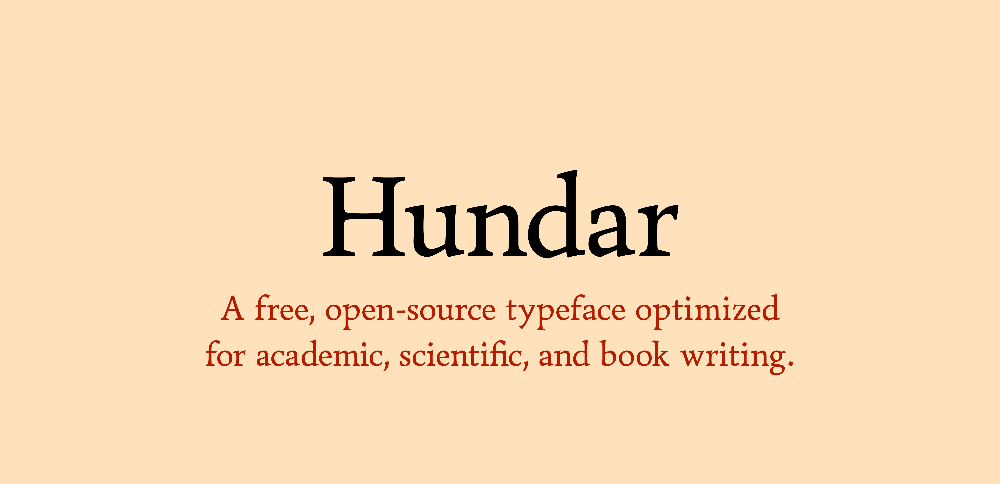

# Lazy Darwin

[![][Fontbakery]](https://The-EPL-Type-Foundry.github.io/EPL-Darwin.git/fontbakery/fontbakery-report.html)
[![][Universal]](https://The-EPL-Type-Foundry.github.io/EPL-Darwin.git/fontbakery/fontbakery-report.html)
[![][GF Profile]](https://The-EPL-Type-Foundry.github.io/EPL-Darwin.git/fontbakery/fontbakery-report.html)
[![][Shaping]](https://The-EPL-Type-Foundry.github.io/EPL-Darwin.git/fontbakery/fontbakery-report.html)

[Fontbakery]: https://img.shields.io/endpoint?url=https%3A%2F%2Fraw.githubusercontent.com%2FThe-EPL-Type-Foundry%2FEPL-Darwin.git%2Fgh-pages%2Fbadges%2Foverall.json
[GF Profile]: https://img.shields.io/endpoint?url=https%3A%2F%2Fraw.githubusercontent.com%2FThe-EPL-Type-Foundry%2FEPL-Darwin.git%2Fgh-pages%2Fbadges%2FGoogleFonts.json
[Outline Correctness]: https://img.shields.io/endpoint?url=https%3A%2F%2Fraw.githubusercontent.com%2FThe-EPL-Type-Foundry%2FEPL-Darwin.git%2Fgh-pages%2Fbadges%2FOutlineCorrectnessChecks.json
[Shaping]: https://img.shields.io/endpoint?url=https%3A%2F%2Fraw.githubusercontent.com%2FThe-EPL-Type-Foundry%2FEPL-Darwin.git%2Fgh-pages%2Fbadges%2FShapingChecks.json
[Universal]: https://img.shields.io/endpoint?url=https%3A%2F%2Fraw.githubusercontent.com%2FThe-EPL-Type-Foundry%2FEPL-Darwin.git%2Fgh-pages%2Fbadges%2FUniversal.json

Lazy Darwin is a free and open-source ty­pe­fa­ce intended for book and article writing, with a particular focus on aca­de­mic and scientific usage. The typeface aims to cover a very wide range of languages, as well as provide support for specialist usage in subjects like medievalist studies and linguistics. Lazy Darwin will also come in several different optical sizes, as well as have an accompanying math font.

## Building

Fonts are built automatically by GitHub Actions - take a look in the "Actions" tab for the latest build.

If you want to build fonts manually on your own computer:

* `make build` will produce font files.
* `make test` will run [FontBakery](https://github.com/googlefonts/fontbakery)'s quality assurance tests.
* `make proof` will generate HTML proof files.

The proof files and QA tests are also available automatically via GitHub Actions — look at https://The-EPL-Type-Foundry.github.io/EPL-Darwin.git.

## About the Author

Emily de Oliveira Santos (she/her) is a mathematician and type designer based on Brazil.
- [Webpage](https://topological-modular-forms.github.io/)
- [Email](mailto:emily.de.oliveira.santos.tmf@gmail.com)

## Dedication
This typeface is dedicated to Juca, Nonami, Mia and Violeta. Each and every one of you forever changed my life for the better, and I wouldn't be here if it weren't for you.

## License

This Font Software is licensed under the SIL Open Font License, Version 1.1.
This license is available with a FAQ at https://openfontlicense.org

## Repository Layout

This font repository structure is inspired by [Unified Font Repository v0.3](https://github.com/unified-font-repository/Unified-Font-Repository), modified for the Google Fonts workflow.
